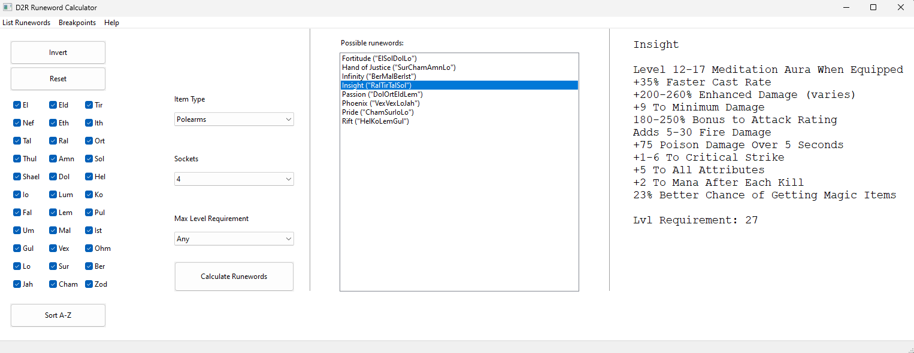
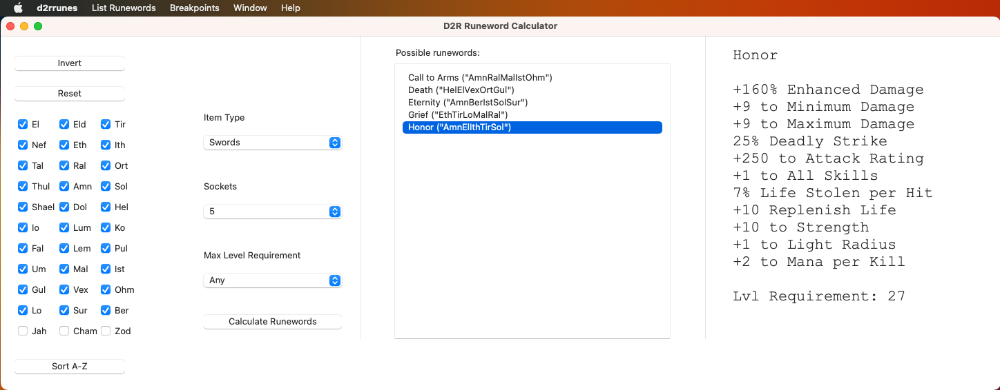

# D2R Runeword Calculator

## Updated For New Expansion - Reign of the Warlock!

## Screenshots

## Description

GUI tool for Windows/Linux/macOS that has been my personal Diablo 2 Resurrected assistant for the last years!

It uses wxWidgets for the GUI and supports the following features:

* Calculates possible runewords (You select which runes you have, which item type base, how many sockets, and optionally a level requirement and it will list all possible runewords you can make)

* Breakpoints for all classes (IBS, FCR, FHR). Attack speed currently not supported but I can recommend https://d2.lc/IAS/

* List of runewords (In case you know the name of a runeword and want to check what it does)

* Rune conversions (Hover your mouse over a rune and it will tell you how to upgrade this rune, what this rune is upgraded from and also which effect this rune has when socketed)

* Sort Runes A-Z or by rarity (sometimes by rarity is better, but sometimes you just want to know how to upgrade ITH in the cube and you know where it is alphabetically but you might not be able to find it quickly if the runes are sorted by rarity)

* Rune word information (lists exact details of every runeword, if runeword has different effect for different item types these are listed too)

---

## How to build from source

### Linux
* Try: `sudo apt install libwxbase3.0-dev libwxgtk3.0-gtk3-0v5 libwxgtk3.0-gtk3-dev` or on newer systems just `sudo apt install libwxgtk3.2-dev`
* ``g++ -std=c++17 *.cpp `wx-config --cxxflags --libs` -o d2rrunes``

### macOS
* Download from [here](https://www.wxwidgets.org/downloads/) under "Source Code" you choose "Source for Linux, macOS, etc"
* Then extract it, move into the folder you downloaded and use `mkdir build-cocoa-debug && cd build-cocoa-debug && ../configure --enable-debug && make && make install`
* Then in the d2r "code" folder you downloaded from here use: ``g++ -std=c++17 *.cpp `wx-config --cxxflags --libs` -o d2rrunes``

### Windows
* Use Visual studio, there are some decent tutorials on YouTube. Much more difficult than building it for Linux or macOS IMO.
